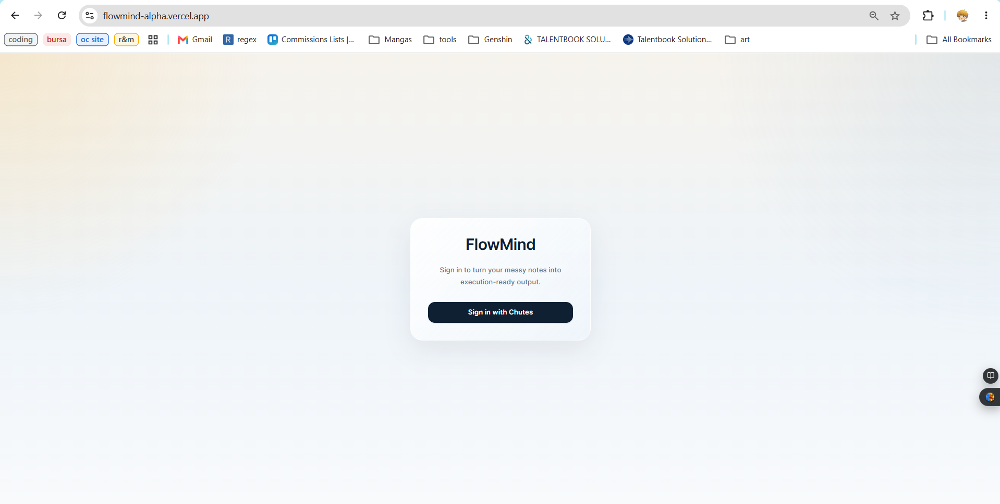
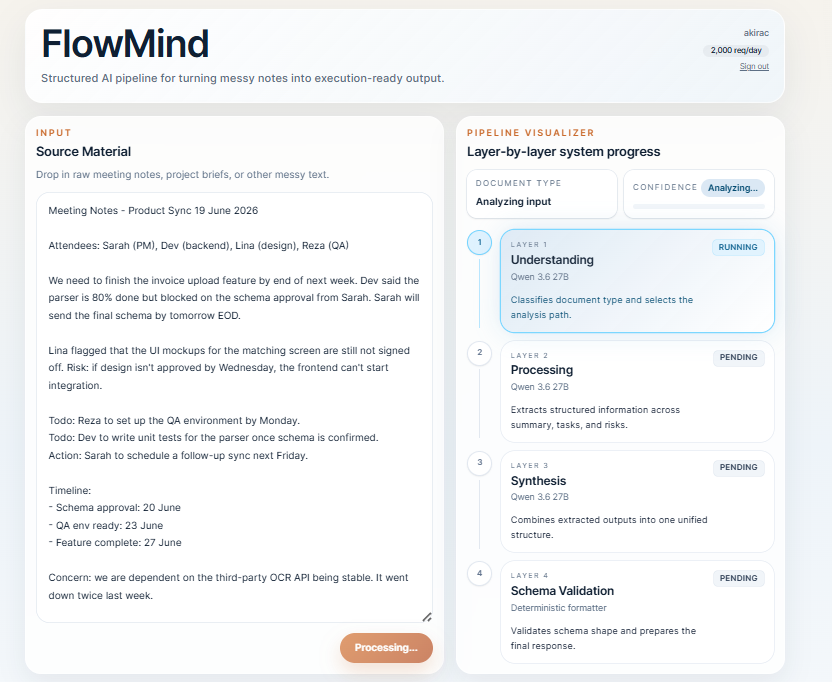
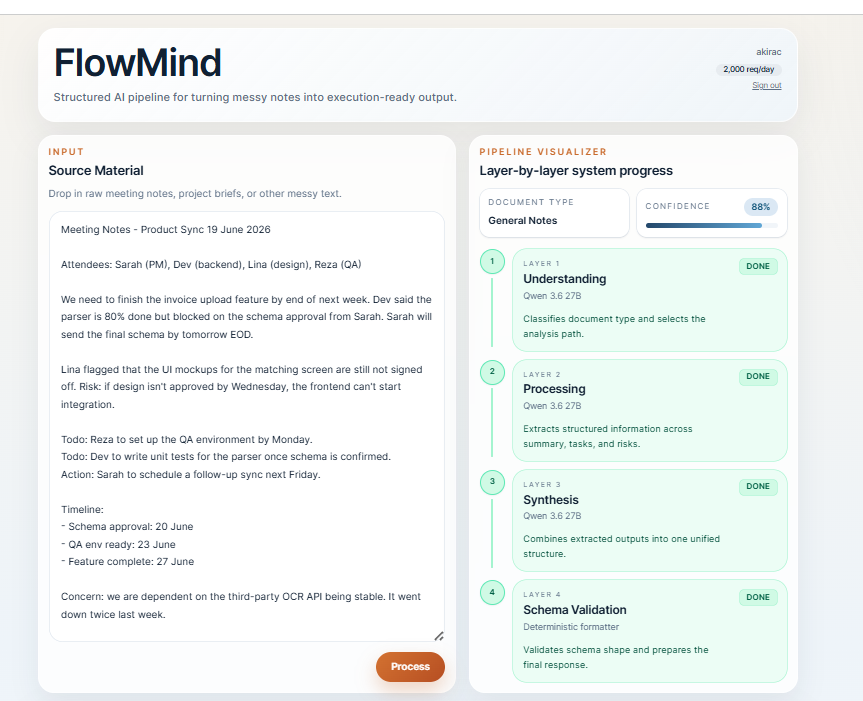
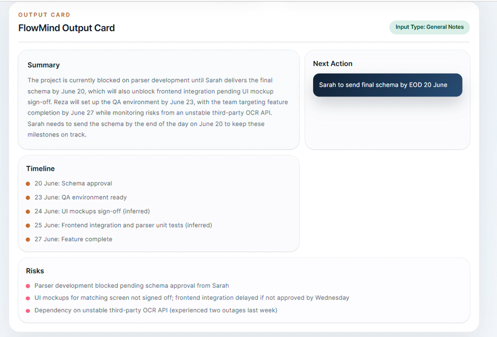

# FlowMind

**Turn messy notes into execution-ready work.**
**A structured AI pipeline for summaries, tasks, timelines, risks, and next actions.**
Paste meeting notes, project briefs, or unstructured updates. FlowMind extracts the signal, validates the structure, and turns it into a work card your team can act on.

[](https://devpost.com/software/flowmind-t24fai)
[](https://chutes-hack-malaysia-2026.devpost.com/)

[](https://www.python.org/)
[](https://fastapi.tiangolo.com/)
[](https://react.dev/)
[](https://vite.dev/)
[](https://chutes.ai/)

**[Watch the Demo](https://www.youtube.com/watch?v=JBIYzOc5Atc&source_ve_path=MjE0Mjgz&embeds_referring_euri=https%3A%2F%2Fdevpost.com%2F)** · **[Devpost](https://devpost.com/software/flowmind-t24fai)** · **[Pitch Deck](archive/FlowMind_Presentation.pdf)** · **[Live App](https://flowmind-alpha.vercel.app/)**

<details>
<summary>Table of Contents</summary>

- [What FlowMind does](#what-flowmind-does)
- [How it works](#how-it-works)
- [Screenshots](#screenshots)
- [Demo access](#demo-access)
- [Tech stack](#tech-stack)
- [Project structure](#project-structure)
- [Run locally](#run-locally)
- [Demo-only configuration](#demo-only-configuration)
- [Deployment](#deployment)
- [License](#license)

</details>

## What FlowMind does

Unstructured input often contains the information a team needs, but not in a form that is easy to execute. FlowMind extracts the signal and organizes it into a practical action plan.

- Classifies the input and estimates confidence
- Extracts tasks, owners, deadlines, risks, and timeline items
- Synthesizes the extracted information into one work card
- Validates the final response against a predictable schema
- Populates detected tasks into a drag-and-drop Kanban board

## How it works

```text
Messy notes
    ↓
1. Understanding       Classify the document and select the analysis path
    ↓
2. Processing          Extract tasks, risks, timeline items, and ownership
    ↓
3. Synthesis           Combine the extracted information into one work card
    ↓
4. Schema validation   Check the structure and prepare the final response
    ↓
Execution-ready output
```

The interface visualizes each layer as it runs, so users can see how raw notes become structured output.

## Screenshots

### Sign in



### Pipeline running



### Pipeline complete



### Structured output



## Demo access

The **Continue as guest** path uses FlowMind’s built-in deterministic demo provider, so visitors can explore the workflow without a Chutes account, API key, Ollama installation, or credits. Guest work is not saved.

Users who sign in with Chutes use the real Chutes-backed pipeline and their own account access.

## Tech stack

- **Frontend:** React, Vite, Tailwind CSS
- **Backend:** FastAPI, Python
- **AI:** Chutes with `Qwen/Qwen3.6-27B-TEE`
- **Authentication:** Chutes OAuth 2.0 with PKCE
- **Deployment:** Vercel

## Project structure

```text
flowmind/
├── backend/
│   ├── app/
│   │   ├── layers/          # Understanding, processing, synthesis, formatting
│   │   ├── ai_client.py     # Chutes, compatible providers, and demo provider
│   │   ├── auth.py          # OAuth, guest session, and logout routes
│   │   ├── main.py          # FastAPI routes
│   │   └── orchestrator.py  # Pipeline coordination
│   └── .env.example
├── frontend/
│   └── src/
│       ├── components/      # Input, pipeline, output, Kanban, login
│       └── App.jsx
├── docs/
│   ├── screenshots/         # Product screenshots
│   ├── AUTH_PLAN.md
│   ├── CHUTES_AUTH.md
│   └── HACKATHON_NEXT_STEPS.md
└── README.md
```

Project planning and authentication notes live in [`docs/`](docs/). The pitch deck is available at [`archive/FlowMind_Presentation.pdf`](archive/FlowMind_Presentation.pdf).

## Run locally

### 1. Configure the backend

```powershell
cd backend
python -m venv .venv
.\.venv\Scripts\Activate.ps1
pip install -r requirements.txt
```

Create `backend/.env`:

```env
CHUTES_CLIENT_ID=cid_xxx
CHUTES_CLIENT_SECRET=csc_xxx
CHUTES_REDIRECT_URI=http://localhost:8000/api/auth/callback
FRONTEND_URL=http://localhost:5173
API_PREFIX=/api
AI_PROVIDER=chutes
FLOWMIND_MODEL=Qwen/Qwen3.6-27B-TEE
```

Start the API:

```powershell
python -m uvicorn app.main:app --reload
```

### 2. Start the frontend

In a second terminal:

```powershell
cd frontend
npm install
npm run dev
```

For local development, set `frontend/.env` to:

```env
VITE_API_BASE_URL=http://localhost:8000/api
VITE_DEBUG_PREVIEW=false
```

Open [http://localhost:5173](http://localhost:5173).

## Demo-only configuration

To run the full app without Chutes access, use the built-in provider:

```env
AI_PROVIDER=mock
```

This does not call Ollama or any external API. It returns deterministic sample output for demos and testing.

## Deployment

The project is configured for Vercel. The production frontend uses:

```env
VITE_API_BASE_URL=/api
```

The backend should be configured with:

```env
CHUTES_CLIENT_ID=cid_xxx
CHUTES_CLIENT_SECRET=csc_xxx
CHUTES_REDIRECT_URI=https://flowmind-alpha.vercel.app/api/auth/callback
FRONTEND_URL=https://flowmind-alpha.vercel.app
API_PREFIX=/api
AI_PROVIDER=chutes
FLOWMIND_MODEL=Qwen/Qwen3.6-27B-TEE
```

For a no-credit showcase deployment, use `AI_PROVIDER=mock` instead.

## License

FlowMind is released under the [MIT License](LICENSE).

